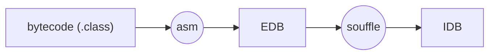
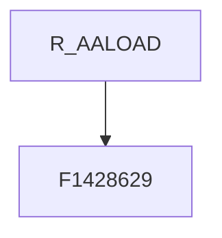
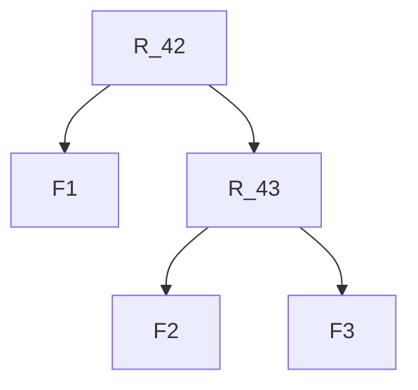
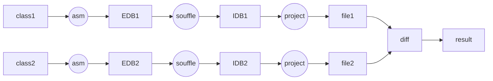

# DALEQ - Datalog-based Binary Equivalence


## Build and Use CLI

DALEQ has been developed and tested with Java 17. 
DALEQ can be build with Maven as follows:

`mvn clean package dependency:copy-dependencies`

Then run DALEQ as follows (for windows: change the classpath separator accordingly):

```
java -DSOUFFLE=<path-to-souffle> -cp "target/classes:target/dependency/*" io.github.bineq.daleq.cli.Main \

 -j1,--jar1 <arg>   the first jar file to compare (required)
 -j2,--jar2 <arg>   the second jar file to compare (required)
 -o,--out <arg>     the output folder where the report will be generated (required)
 -s1,--src1 <arg>   the first jar file with source code to compare (optional)
 -s2,--src2 <arg>   the second jar file with source code to compare (optional)
 -a,--autoopen      if set, the generated html report will be opened automatically (dont use for CLI integration)
```

The jar built can also be used directly as an executable superjar.

```
java -DSOUFFLE=<path-to-souffle> -jar target/daleq-<daleq-version>.jar  \

 -j1,--jar1 <arg>   the first jar file to compare (required)
 -j2,--jar2 <arg>   the second jar file to compare (required)
 -o,--out <arg>     the output folder where the report will be generated (required)
 -s1,--src1 <arg>   the first jar file with source code to compare (optional)
 -s2,--src2 <arg>   the second jar file with source code to compare (optional)
 -a,--autoopen      if set the generated html report will be opened automatically (dont use for CLI integration)
```

Running the program will create a report `report.html` in the specified output folder.

The program returns with the following exit codes:

```
0 - all classes and resources are equal, source codes (if analysed) are equivalent
1 - some classes are not equal but still equivalent, resources are equal, source-codes (if analysed) are equivalent
2 - some classes are not equivalent (wrt daleq) or some resources (e.g. metadata) are not equal or some sources (if analysed) are not equivalent
```

This can be used to integrate the tool into CI processes.

## Overview

*Daleq* takes Java bytecode as input and produces a relational database.
This is done in two steps.

### Step 1 - EDB Extraction



A database representing the bytecode is extracted. An [asm-based](https://asm.ow2.io/) static analysis is used for this purpose.
The result is the EDB (extensional database), a folder with tsv files, each tsv file corresponding to a predicate.
Those facts represent the bytecode, including class name, bytecode version, super types and interfaces,
access flags for method, fields and classes, bytecode instructions in methods, etc.

The representation is low-level, however, there is one significant abstraction (provided by _asm_): constant pool references are
resolved.

Each fact has a unique generated id that is used to provide provenance.

### Step 2 - IDB Computation

The IDB computation applies rules to compute a second set of facts (IDB files) that normalises
the EBD to establish whether two bytecode compared are equivalent or not.

Rules that are applied for this purpose are defined in
`src/main/resources/rules/`, `advanced.souffle` is the default set.

The API to generate the IDB is provided by `io.github.bineq.daleq.Souffle::createIDB`.
This requires *souffle* to be installed.
Any application that uses this API must provide the location of [souffle](https://souffle-lang.github.io/) via an argument
that is passed to the JVM:

```
-DSOUFFLE=<path to souffle binary>
```

## Provenance

The first slot (term) for each fact is an *id*.
For EDB facts, those ids are generated during the bytecode analysis / extracyion phase.

Example (from `AALOAD.facts`):

```csv
F1428629	org/apache/hadoop/hdfs/HAUtil::getConfForOtherNodes(Lorg/apache/hadoop/conf/Configuration;)Ljava/util/List;	3200
```

When the IDB is created, each IDB fact also has this slot.
The  values encode a derivation tree. Example:

```csv
R_AALOAD[F1428629]  ...
```

This fact has been computed by applying rule `R_AALOAD` to fact `F1428629`.
I.e. those ids encode a derivation tree:



A less trivial example is `R_42[F1,R_43[F2,F3]] ` , this encodes the following derivation tree:  



The project contains a parser to transform those strings into
trees (`io.github.bineq.daleq.souffle.provenance.ProvenanceParser`).

The grammar of the encoded proofs is defined here:
`src/main/antlr4/io/github/bineq/daleq/souffle/provenance/Proof.g4`.


## Comparing Bytecode

When trying to establish equivalence between two (compiled) classes, IDBs cannot be compared directly for the following reasons:

1. The provenance (id) terms -- this reflects the process of normalisation that might be different for each of the classes compared
2. the IDB contains additional facts for predicates to keep track of facts that have been removed (i.e. EDB facts that have no counterpart in the IDB), or moved.
3. facts corresponding to bytecode instruction have an `instructioncounter` slot to define the order of instructions within a method. Those might change in the IDB as normalisation may move/remove/insert facts corresponding to instructions.

### Projection

The purpose of *projection* is to remove the aforementioned parts (facts and slots) from the database.
At the moment normalisation is implemented in Java.

### Workflow to Compare two Binaries

The classes `io.github.bineq.daleq.idb.IDBReader` and `io.github.bineq.daleq.idb.IDBPrinter` are used to read an IDB,
and convert it into a textual representation suitable for comparison and diffing (using a standard text fiff tool such as _diff_ or _kdiff3_). This also supports projection.




## The Generated Report

This is an example of a generated report.  Here, we have compared the jar file for the artifact
_javax.transaction:jta:1.1_ from Maven Central with the corresponding artifact rebuilt by Google's assured open source.
Daleq employs various analysers to compare classes, meta-data and resources within the jars. 
The results are displayed in a table, the rows correspond to files within the jar(s), and the columns correspond to the various analysers. 
Analysers compare the content of files, specialised analysers are used to compare source code and bytecode. The actual daleq analyser results are displayed in the last column. Please have a look at our paper for more details.

Possible analysis result states are:

- **PASS** the comparison yields true
- **FAIL** the comparison yields false
- **N/A** the comparison cannot be applied (e.g., a source Code comparison cannot be used to compare bytecode)
- **ERROR** the comparison has resulted in an error


The markers next to each result are hyperlinks to generated pages with additional provenance. 
For non-equivalence statements, those pages are usually diff reports rendered in HTML. 
For daleq equivalence statements, advanced diff reports are generated based on the derivations recorded when datalog rules are applied.
This is an example:


## Extracting Facts from Bytecode

```
usage: java -cp <path-to-built-jar> io.github.bineq.daleq.edb.FactExtractor
 -cl <classes>   the location of compiled classes, a jar file or folder
 -f <facts>      a folder where to create the extension database (input
                 .facts files), the folder will be created if it does not
                 exist
 -s <souffle>    a file where to create the souffle program (.souffle
                 file) containing imports and input predicate declarations
 -v              whether to verify the datalog facts against the schema,
                 must be true or false, default is true
```

### Mapping Bytecode Instructions to Predicates

The mapping is defined by a *mapping spec* (a JSON file) in `src/main/resources/instruction-predicates` for each byte code instruction, e.g. `AALOAD.json`.

```json
{
  "name": "AALOAD",
  "opCode": 50,
  "slots": [
    {
      "name": "factid",
      "type": "SYMBOL",
      "jtype": "java.lang.String"
    },
    {
      "name": "methodid",
      "type": "SYMBOL",
      "jtype": "java.lang.String"
    },
    {
      "name": "instructioncounter",
      "type": "NUMBER",
      "jtype": "int"
    }
  ],
  "id": "0e041734-aa00-467a-ba0f-e089b5d888cf",
  "asmNodeType": "org.objectweb.asm.tree.InsnNode"
}
```

From this file, a mapping class is statically generated, the sources can be found in `src/main/java/io/github/bineq/daleq/edb/instruction_fact_factories/`, e.g. `InstructionFactFactory__AALOAD.java`.
Those mappings are read using a service factory, i.e. the following file must contain a line with the name of each mapping used:
`src/main/resources/META-INF/services/io.github.bineq.daleq.edb.InstructionPredicateFactFactory`.


### Adding New Mappings

When an instruction with no associated mapping is encountered, a warning appears in the log, and the mapping spec is generated in `inferred-instruction-predicates`.

The proceed as follows:

1. copy the new spec into `src/main/resources/instruction-predicates`
2. run `io.github.bineq.daleq.edb.InstructionFactFactoryCodeGenerator` to generate the respective mapping class
3. copy the mapping class into `src/main/java/io/github/bineq/daleq/edb/instruction_fact_factories/`
4. add a row with the new mapping class to `src/main/resources/META-INF/services/io.github.bineq.daleq.edb.InstructionPredicateFactFactory`
5. update the rules in `src/main/resources/rules` to add support for the new mapping

For the last step, each instruction has the following block defining an IDB predicate (the respective EDB predicate is generated), and
a rule that maps this to a generic `IDB_INSTRUCTION` predicate. Example:

```
.decl IDB_AALOAD(factid: symbol,methodid: symbol,instructioncounter: number)
IDB_AALOAD(cat("R_AALOAD","[",factid,"]"),methodid,instructioncounter) :- AALOAD(factid,methodid,instructioncounter),!REMOVED_INSTRUCTION(_,methodid,instructioncounter).
.output IDB_AALOAD
IDB_INSTRUCTION(cat("R_AALOAD","[",factid,"]"),methodid,instructioncounter,"AALOAD") :- AALOAD(factid,methodid,instructioncounter).
```

For a new predicate, such a block must be added.
The rule generator `io.github.bineq.daleq.idb.rulegeneration.BaselineRuleGeneration` can be used for this purpose.

## Notes

### Testing during Builds

Note that tests requires souffle to be set up (see also **IDB Computation** section).
This has to be done locally at the moment, see also [issue 11](https://github.com/binaryeq/daleq/issues/11).
Tests that require souffle will not fail but will be skipped if souffle is not available.

### Performance and Issues with Souffle

Souffle [occasionally fails](https://github.com/binaryeq/daleq/issues/22).
When souffle is used, a `Thread::sleep` instruction is used to pause DALEQ.
This reduces the number of errors (perhaps a souffle race condition?), but makes DALEQ slower.

Souffle issues will be reported by the appplication, and flagged as __error__ .

### Adding Your Own Analyser

Additional analysers can be easily added by following those steps:

1. Write an analyser (say `MyAnalyser`) implementing `io.github.bineq.daleq.cli.Analyser`
2. In your project, add a file `src/main/resources/META-INF/services/io.github.bineq.daleq.cli.Analyser`
3. Add a line with the fully qualified name of `MyAnalyser` to this file
4. Build a jar file
5. When running DALEQ, add this jar file to the classpath
6. Note that the order in which columns are displayed in reports is determined by the property `io.github.bineq.daleq.cli.Analyser::positionHint`, a values between 0 and 100.


## Contributing

To contribute to this project, please follow the steps below to set up your development environment.

First, create a virtual environment to isolate dependencies:

```bash
python3 -m venv .venv
```

Activate the virtual environment and install the `pre-commit` hooks.

```bash
source .venv/bin/activate
pip install -r requirements.txt
pre-commit install
```

Now, the hooks will automatically run on each commit to check for any issues in the code. You can manually run the pre-commit hooks on all files at any time with:

```bash
pre-commit run --all-files
```

## Sponsors


[Oracle Labs Australia](https://labs.oracle.com/)
